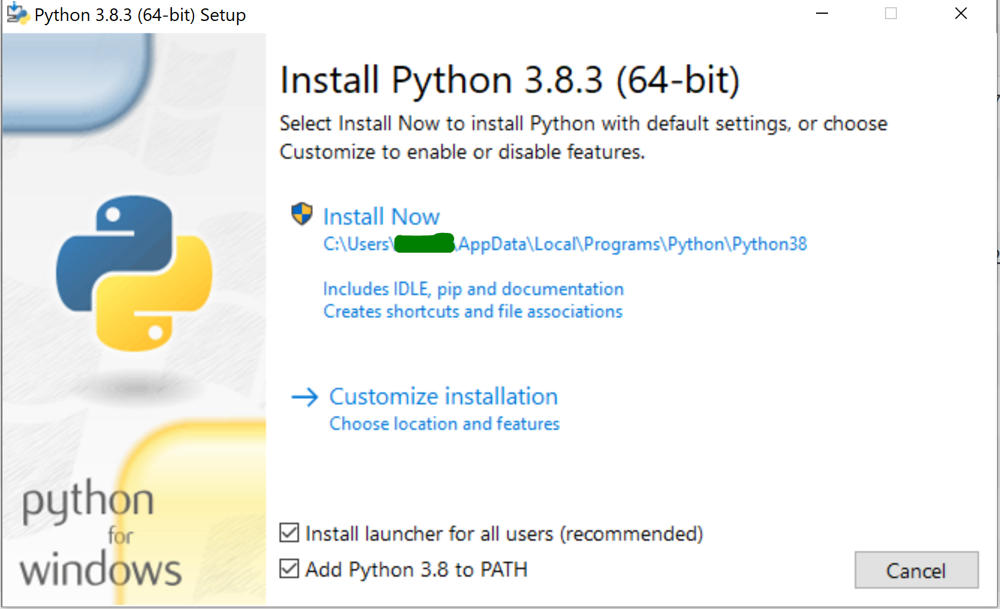

[<div style="text-align:center"></div>](https://www.sruk.org.uk)

# <div style="text-align:center">SRUK Research Computing Workshop - Part 2<br>**Python**</div>

# Index

1. [About the workshop](#about-the-workshop)
1. [Schedule](#schedule)
1. [Setting up the environment](#setting-up-the-environment)
    1. [Without installing Python in your computer](#without-installing-python)
    1. [You already have Python installed](#you-already-have-python)
    1. [Installing Python from scratch](#installing-python-from-scratch)
    1. [Installing the dependencies](#installing-the-dependencies)
    1. [Checking that everything works](#checking-that-everything-works)
1. [Using Jupyter Lab and Notebooks](#using-jupyter-lab-and-notebooks)


# About the Workshop

Welcome to this second event of the SRUK Research Computing Workshop series, devoted to Python. Python is programming language that has become one of the dominant tools in research and teaching thanks to its flexibility, simplicity, and enormous supporting community. Specifically, this hands-on workshop will cover the following content:

- Brief introduction to the basics
- Overview of Python packages and developing your own libraries
- Numerical computation with [Numpy](https://numpy.org/) and [Scipy](https://www.scipy.org/)
- Data science with [Pandas](https://pandas.pydata.org/)
- Professional-looking figures with [Matplotlib](https://matplotlib.org/)

This workshop is at a beginners-intermediate level. Although there will be an introduction to basic Python, we will not linger over it for too long and will move soon to more advanced – and useful – stuff. Even though we will not go through very complicated examples, you are more than welcome to go through some basic Python concepts on your own prior to the workshop (e.g., check the first half of the content provided [here](https://imperialcollegelondon.github.io/python-novice-mix/)) and get the most out of this training!

Join this event if you want to…

- Create your own libraries of recurrent functions and tools you will be using to analyse your data.
- Analyse your data, fitting it to complex functions using powerful algorithms or exploring their statistical properties.
- Learn how to easily generate publication-quality figures.

If time allows, at the end of the workshop we will provide tips and resources for those wanting to expand their knowledge on other topics such as differential equation solving, parallel computing, machine learning, and deep learning.


# Schedule

Lessons will be uploaded on the 26th of June. You will need then to either update your local repository with `git pull` if you are a git user or [download the repository](https://github.com/dalonsoa/SRUK_Research_Computing_Workshop/archive/master.zip) as a zip file and unzip it. Please, **keep reading!**

- **9:00 - Welcome and setting up**
- 9:30 - Introduction
- 9:45 - The basics
- 10:30 - Python packages and modules
- **11:15 - Coffee reak**
- 11:30 - Functions
- 12:10 - Classes
- **13:00 - Lunch time!**
- 14:00 - Numpy and Matplotlib
- **15:15 - Coffee break**
- 15:30 - Pandas
- 16:30 - Scipy
- 17:15 - Final remakrs
- **17:30 - End of the event**

# Setting up the environment

### **<p style="text-align: center;">Follow this instructions *BEFORE* the start of the course on the 27th of June.<br>Contact us via Eventbrite if you have any trouble.</p>**
The aim of this workshop is to provide you with the fundamental knowledge of the tools you will need to exploit Python in your research. **We want you to code along with us**, to try things and ask questions whenever you don't get the expected results. Chances are that other colleagues will be on the same situation. 

To make this workshop as user friendly as possible, we will use [Jupyter](https://jupyter.org). In the [lessons folder](lessons) you can find the Jupyter Notebooks we have prepared. Notebooks combine text and explanations (including equations written in Latex, if needed) with executable code and its output, being this a bunch of numbers, some texts or plots. For this reason, it is becoming quite popular in the teaching environment. The [final section of this document](#using-jupyter-lab-and-notebooks) show a few tips on how to interact with the notebooks.

We strongly encourage you to install Python and all the relevant dependencies locally in your computer. However, if you prefer not to - at least not yet - that's OK. Keep reading to the next subsection.

## Without installing Python

If you cannot or do not want to install Python in your computer, that's also fine. You can edit and run all the notebooks in this repository using Binder. Do right-clik "Open in new tab" in this badge:

[](https://mybinder.org/v2/gh/dalonsoa/SRUK_Research_Computing_Workshop/master?urlpath=lab)

This will launch a remote session of Jupyter in a service called [MyBinder.org](https://mybinder.org). This is an amazing tool that let you open, edit and run notebooks in any public repository. Launching the server might take some time depending on the number of users trying to access that particular repository and the workload of the server itself, but after a few seconds/minutes, it should be up and running. To learn how to interact with the notebooks, go to the [final section of this document](#using-jupyter-lab-and-notebooks).

Using this service has some limitations:

- The session in Binder will expire after 10 min of inactivity, so make sure you keep interacting with it - code along!
- How smooth things run will depend on the stability of your internet connection and of the server itself, so things might become slow at times or the server drop without notice. 
- The code you write will be in a remote location. If you want to keep it, you will need to download the edited notebooks from time to time, otherwise, all changes will be lost if you disconect (voluntarily or not) from the server.

## You already have Python

If you already have Python, you still need to do a couple of things.

1. Make sure your Python version is 3.4 or higher. To check which python version you have, keep reading.
2. Make sure you can access Python from the Terminal/Console/PowerShell - we'll call this with the generic name of "shell". To do so, open a shell and type `python --version`. If you get an error or a number that is not >3.4, then your python is not correctly configured (or the version is not high enough). I suggest you move to the next section. In some systems, you might need to use `python3 --version`.
3. If you reach this point, then you can now [install the dependencies](#installing-the-dependencies)

## Installing Python from scratch

If you haven't used Python much - or nothing at all - chances are you want a brand new Python installation in your system. Let's install the newest Python version, which at the time of writing this guide is 3.8. How to do that depends on your operative system:

- **Linux**: You will need to use the package manager of your distribution. For Ubuntu, this will require you to open a shell and run `sudo apt install python3`. For other distributions, it will depend... In some cases, this will not be Python 3.8, but 3.7 - or even 3.6! That's Ok as long as it is >3.4. 
- **Windows and MacOS**: Go to [python.org](https://www.python.org), the official Python distribution, and download the installer appropriate for your OS. To install the latest version, just click the link under the section "Download" (you can also click [here](https://www.python.org/downloads/release/python-383/) for the latest version, v3.8.3 as of 2020-06-20) and scroll down until the bottom of the page. There, you will see the section "Files", where you can click the link to start the download according to your OS. While Mac users only have one link to download Python3 (click [here](https://www.python.org/ftp/python/3.8.3/python-3.8.3-macosx10.9.pkg)), Windows users have several options. We recommend them to download the executable installer (click [here](https://www.python.org/ftp/python/3.8.3/python-3.8.3-amd64.exe)).

    **WARNING for WINDOWS USERS**: Once you start the executable installer, you will see a new window popping up. 
    
    <div style="text-align:center"><\dic>
    
    Please select "Add Python 3.8 to PATH" and "Install launcher for all users (recommend)" if they are not already ticked. We strongly recommend that you click "Install Now" instead of "Customize installation". By clicking the former (which requires administrator permissions), everything you need to have installed to run Python 3.8.3 will be installed - which might not happen if you customize your installation. Therefore, just let the executable installer do its magic for you :).

That should be it! If you open a shell and run `python --version` (or `python3 --version`) you should see the version of Python you have just installed.

Now you are ready to install the dependencies.

## Installing the dependencies

Most pieces of software have dependencies: packages and libraries they need to run. In our case, we need to install Jupyter Lab, which is the interface we will use, and also numpy, matplotlib, scipy and pandas, the whole point of this workshop! 

But, first, get this repository itself into your computer:

- Download this repository by clicking in the green button in the top right (or [here](https://github.com/dalonsoa/SRUK_Research_Computing_Workshop/archive/master.zip)) and unzip it somewhere you know, eg. in your Documents folder. If you are a `git` user, navigate to the Documents folder in the shell and clone it with:

```bash
git clone https://github.com/dalonsoa/SRUK_Research_Computing_Workshop.git
```

- Now you should have all the files of the workshop in the folder `Documents/SRUK_Research_Computing_Workshop`. Enter into that folder in the shell with `cd SRUK_Research_Computing_Workshop`.
- You can find this dependencies needed for this workshop in the `requirements.txt` file. To install these dependencies just run in the shell:

```bash
python -m pip install -r requirements.txt
```

There will be a lot of text printed indicating that the dependencies - those in the requirements.txt file and many others that are required by these pacakges themselves - are being downloaded and installed. Hopefully, there will be no errors. 

## Checking that everything works

To check that everything has been installed properly, the simplest thing is for you to try to launch a Jupter Lab session. For that, without leaving the repository folder, run:

```bash
python -m jupyter lab
```

A new tab should open in the web browser showing the Jupyter Lab interface. If that is the case, congratulations: You have succesfully installed all the requirements of this Workshop and have completed Lesson 0. Believe it or not, doing this has made you much wiser and proficient in Python. 

In the final section of this document, we will just mention a couple of things on using Jupyter Notebooks. 

# Using Jupyter Lab and Notebooks

Jupyter Lab is a very powerful programming and data analysis environment for Julia, Python and R (hence the name, more or less: **JU**lia**PYT**on(**E**)**R**, the "E" shouldn't be there...). We have installed support only for Python - which is the default - but if you are interested, you can check other options [here](https://jupyterlab.readthedocs.io/en/stable/getting_started/overview.html). You can allso get all the information from the "Help" entry on the Jupyter lab menu above.

When you launch Jupyter lab, there're should be a new tab in your browser showing something similar to the folligin image. On the left, there'se a file browser that let you navigate across the folders and files that make up this repository. On the right hand side, you will see the same README file you saw in the GiHub repository (and that you are reading). 

<div style="text-align:center"></div>

If you double-click on the "lessons" entry on the left, you will enter into the lessons folder. If you double click on any of the lessons, a Jupyter Notebook will open as a new tab next to the README file. By the time you read this document, those lessons will probably be empty, but you will see the content from the 26th of June. 

<div style="text-align:center"></div><div style="text-align:center"></div>
    
Lessons are writen as Jupyter Notebooks. These are documents divided in cells. Typically, these cells will be written in markdown - explanations -, python code - actuall code you can execute -, and output - the result (if any) of a python command. Cells are executted by pressing simultaneouslly `SHIFT + ENTER`. Pressing just `ENTER` only creates a new line within the current cell. 

For all purposes, a cell writtern but not executed, does not exist: the code written there is ignored. Also, keep in mind that the execution order is important: a cell will know about things that have been **executed** before, even if they appear further down in a Notebook. If you want to reset the notebook, you need to re-star the kernel. On the Jupyter Lab menu click Kernel -> Restart Kernel. 
    
You can get a summary of all the shortcuts available in a Jupyter Notebook in [this cheatsheet](https://cheatography.com/weidadeyue/cheat-sheets/jupyter-notebook/). 